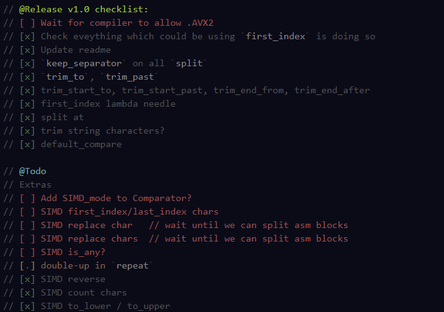

# The Language - Jai Language support

VSCode extension for Jai language support.

Syntax highlighting:


Highlight language inside herestring (postfix `HERE` with language ID)...


...which lets you nicely embed shaders


Uses Markdown for docstrings


Comment tags + checklists


Autocomplete x64 instructions


# IDE-like functionality

*Note: this feature is far from polished!*

The extention provides Rename, Definition and Reference Providers.  These work using the compiler, so you need to set the compiler location extension setting (the path to the executable).  If you want to use them in a project then you need to tell the extension what your root jai file is for the project (i.e. the file you compile to build the project).  To do so, in the project folder make a `.vscode/settings.json` file that looks like this:

```json
// Place your settings in this file to overwrite default and user settings.
{
    "the-language.projectFile": "c:\\path\\to\\build.jai"
}
```

If that file sets up its own compiler workspaces when compiling then you will need to get those workspaces to co-operate with the extension (or the extension will not see its compiler messages).  The extension will set `build_options.user_data_u64` to point to a function with this signature:

```jai
    check_message :: (message: *Message) -> valid: bool, complete: bool
```

You need to use this function in your message loop.  Example:

```jai
default_check_message :: (message: *Message) -> valid: bool, complete: bool {
    if !message return false, false;
    if message.kind == .COMPLETE return false, true;
    return true, false;
}

check_message := default_check_message;
is_dummy_compile := false;
build_options := get_build_options();
if build_options.user_data_u64 {
    check_message = <<cast(*type_of(default_check_message)) build_options.user_data_u64;
    is_dummy_compile = true;
}

if !is_dummy_compile {
    // extra work when you're actually building like choosing build mode
    // that we want to skip when we're just using the compiler to parse the
    // codebase.
}

compiler_begin_intercept(workspace);
while true {
    message := compiler_wait_for_message();

    valid, complete := check_message(message);
    if complete  break;
    if !valid    continue;

    do_what_you_want_with(message);
}
compiler_end_intercept(workspace);
```
